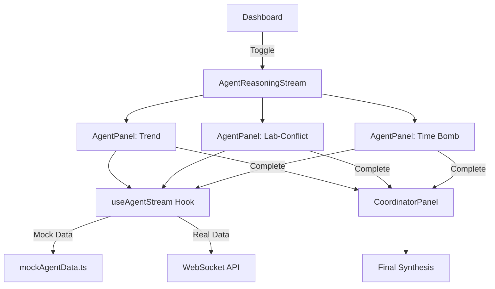
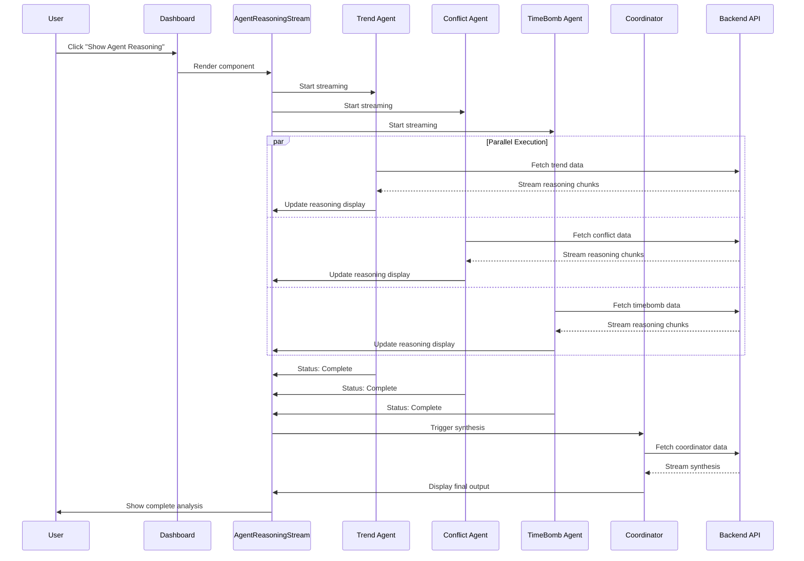
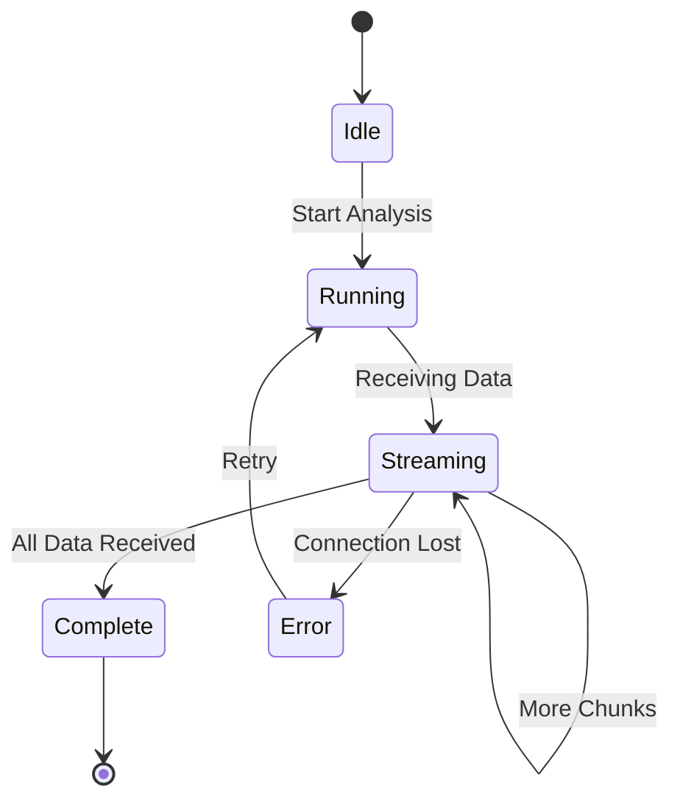

# Agent Reasoning Stream Component - Implementation Plan

## Overview

The Agent Reasoning Stream is a live, multi-agent visualization component designed to showcase the parallel execution of three AI agents (Trend, Lab-Conflict, and Time Bomb) for the IBM Bob Showcase. This component provides real-time visibility into agent reasoning, demonstrating the system's multi-agent architecture to judges in a compelling, BobShell-style interface.

**Key Goal**: Visual proof of multi-agent parallelism with live reasoning output for non-technical judges.

---

## 1. Component Architecture

### 1.1 Component Hierarchy

```
AgentReasoningStream (Container)
├── AgentPanel (Trend Agent)
│   ├── AgentHeader
│   ├── AgentStatusIndicator
│   ├── ReasoningStream
│   └── AgentFooter
├── AgentPanel (Lab-Conflict Agent)
│   ├── AgentHeader
│   ├── AgentStatusIndicator
│   ├── ReasoningStream
│   └── AgentFooter
├── AgentPanel (Time Bomb Agent)
│   ├── AgentHeader
│   ├── AgentStatusIndicator
│   ├── ReasoningStream
│   └── AgentFooter
└── CoordinatorPanel (Appears after all complete)
    ├── CoordinatorHeader
    ├── SynthesisStream
    └── FinalOutput
```

### 1.2 File Structure

```
FE/src/features/agent-reasoning/
├── components/
│   ├── AgentReasoningStream.tsx       # Main container
│   ├── AgentPanel.tsx                 # Individual agent panel
│   ├── AgentStatusIndicator.tsx       # Status badge (RUNNING/COMPLETE)
│   ├── ReasoningStream.tsx            # Streaming text display
│   ├── CoordinatorPanel.tsx           # Final synthesis panel
│   └── index.ts                       # Exports
├── hooks/
│   ├── useAgentStream.ts              # WebSocket/SSE streaming logic
│   ├── useAgentStatus.ts              # Agent status management
│   └── index.ts
├── types/
│   ├── agent-stream.types.ts          # Streaming-specific types
│   └── index.ts
└── utils/
    ├── mockAgentData.ts               # Mock streaming data
    └── index.ts
```

---

## 2. Data Flow & Integration

### 2.1 Data Sources

**Phase 1: Mock Data (Initial Development)**
- Simulated streaming with setTimeout/setInterval
- Pre-defined reasoning text chunks
- Controlled timing for demo purposes

**Phase 2: Real Backend Integration**
- WebSocket connection for real-time streaming
- Server-Sent Events (SSE) as fallback
- REST API endpoints for historical data

### 2.2 API Integration Points

Based on the OpenAPI schema, the component will consume:

```typescript
// Trend Agent Output
GET /api/v1/patients/{patient_id}/trends
Response: TrendReport {
  patient_id: string
  timestamp: string
  trends: VitalTrend[]
  overall_concern: 0-3
  summary: string
  llm_reasoning: string  // ← Stream this
}

// Lab-Conflict Agent Output
GET /api/v1/patients/{patient_id}/conflicts
Response: ConflictReport {
  patient_id: string
  timestamp: string
  conflicts: ConflictPattern[]
  overall_severity: 0-3
  summary: string
  llm_reasoning: string  // ← Stream this
}

// Time Bomb Agent Output
GET /api/v1/patients/{patient_id}/timebombs
Response: TimeBombReport {
  patient_id: string
  timestamp: string
  timebombs: TimeBombItem[]
  overall_urgency: 0-3
  summary: string
}
```

### 2.3 Streaming Strategy

```typescript
interface StreamChunk {
  agent_id: 'trend' | 'lab-conflict' | 'timebomb' | 'coordinator'
  chunk_type: 'reasoning' | 'status' | 'result'
  content: string
  timestamp: string
  is_final: boolean
}

// WebSocket message format
{
  type: 'agent_stream',
  patient_id: '10006',
  chunks: StreamChunk[]
}
```

---

## 3. Component Design Specifications

### 3.1 Layout Strategy

**Desktop (≥1280px)**
```
┌─────────────────────────────────────────────────────────────┐
│  [Trend Agent]  │  [Lab-Conflict]  │  [Time Bomb Agent]     │
│   RUNNING       │    RUNNING       │     RUNNING            │
│  ─────────────  │  ─────────────   │  ─────────────         │
│  Reasoning...   │  Reasoning...    │  Reasoning...          │
│  streaming      │  streaming       │  streaming             │
│  text here      │  text here       │  text here             │
└─────────────────────────────────────────────────────────────┘
│                [Coordinator Panel]                          │
│                   SYNTHESIZING                              │
│                 Final reasoning...                          │
└─────────────────────────────────────────────────────────────┘
```

**Tablet (768px - 1279px)**
```
┌──────────────────────┬──────────────────────┐
│  [Trend Agent]       │  [Lab-Conflict]      │
│   RUNNING            │    RUNNING           │
└──────────────────────┴──────────────────────┘
┌──────────────────────────────────────────────┐
│  [Time Bomb Agent]                           │
│   RUNNING                                    │
└──────────────────────────────────────────────┘
┌──────────────────────────────────────────────┐
│  [Coordinator Panel]                         │
└──────────────────────────────────────────────┘
```

**Mobile (<768px)**
```
┌──────────────────────────────────────────────┐
│  [Trend Agent]                               │
│   RUNNING                                    │
└──────────────────────────────────────────────┘
┌──────────────────────────────────────────────┐
│  [Lab-Conflict Agent]                        │
│   RUNNING                                    │
└──────────────────────────────────────────────┘
┌──────────────────────────────────────────────┐
│  [Time Bomb Agent]                           │
│   RUNNING                                    │
└──────────────────────────────────────────────┘
┌──────────────────────────────────────────────┐
│  [Coordinator Panel]                         │
└──────────────────────────────────────────────┘
```

### 3.2 Visual Design

**Color Scheme (Aligned with existing design system)**
```css
/* Agent Panel Colors */
--agent-trend-accent: #3b82f6      /* Blue */
--agent-conflict-accent: #eab308   /* Yellow/Warning */
--agent-timebomb-accent: #ef4444   /* Red/Critical */
--agent-coordinator-accent: #8b5cf6 /* Purple */

/* Status Colors */
--status-running: #3b82f6          /* Blue pulse */
--status-complete: #22c55e         /* Green checkmark */
--status-error: #ef4444            /* Red X */

/* Background */
--agent-panel-bg: var(--color-bg-panel)
--agent-panel-border: var(--color-border-subtle)
```

**Typography**
- Agent Name: `text-sm font-bold uppercase tracking-wider`
- Status: `text-xs font-semibold`
- Reasoning Text: `text-sm font-mono leading-relaxed`
- Timestamps: `text-xs text-muted font-mono`

**Spacing**
- Panel Gap: `gap-4` (mobile) → `gap-6` (desktop)
- Panel Padding: `p-4` (mobile) → `p-6` (desktop)
- Reasoning Line Height: `leading-relaxed` (1.625)

### 3.3 Animation & Transitions

**Status Indicator**
```css
/* Running state - pulsing animation */
.status-running {
  animation: pulse 2s cubic-bezier(0.4, 0, 0.6, 1) infinite;
}

@keyframes pulse {
  0%, 100% { opacity: 1; }
  50% { opacity: 0.5; }
}
```

**Text Streaming Effect**
```typescript
// Typewriter effect for reasoning text
const streamText = (text: string, speed: number = 30) => {
  let index = 0;
  const interval = setInterval(() => {
    if (index < text.length) {
      setDisplayText(prev => prev + text[index]);
      index++;
    } else {
      clearInterval(interval);
    }
  }, speed);
};
```

**Panel Appearance**
```css
/* Staggered fade-in for panels */
.agent-panel {
  animation: fadeInUp 0.5s ease-out forwards;
}

.agent-panel:nth-child(1) { animation-delay: 0s; }
.agent-panel:nth-child(2) { animation-delay: 0.1s; }
.agent-panel:nth-child(3) { animation-delay: 0.2s; }

@keyframes fadeInUp {
  from {
    opacity: 0;
    transform: translateY(20px);
  }
  to {
    opacity: 1;
    transform: translateY(0);
  }
}
```

---

## 4. Component Implementation Details

### 4.1 AgentPanel Component

```typescript
interface AgentPanelProps {
  agentId: 'trend' | 'lab-conflict' | 'timebomb'
  agentName: string
  accentColor: string
  status: 'idle' | 'running' | 'complete' | 'error'
  reasoning: string[]  // Array of reasoning chunks
  result?: TrendReport | ConflictReport | TimeBombReport
  onComplete?: () => void
}

export function AgentPanel({
  agentId,
  agentName,
  accentColor,
  status,
  reasoning,
  result,
  onComplete
}: AgentPanelProps) {
  const [displayedText, setDisplayedText] = useState<string[]>([]);
  
  // Stream reasoning text with typewriter effect
  useEffect(() => {
    if (status === 'running' && reasoning.length > displayedText.length) {
      const nextChunk = reasoning[displayedText.length];
      streamText(nextChunk, (text) => {
        setDisplayedText(prev => [...prev, text]);
      });
    }
  }, [reasoning, status]);

  return (
    <div className={`agent-panel border-l-4`} style={{ borderColor: accentColor }}>
      <AgentHeader name={agentName} accentColor={accentColor} />
      <AgentStatusIndicator status={status} />
      <ReasoningStream 
        chunks={displayedText}
        isStreaming={status === 'running'}
      />
      {status === 'complete' && result && (
        <AgentFooter result={result} />
      )}
    </div>
  );
}
```

### 4.2 ReasoningStream Component

```typescript
interface ReasoningStreamProps {
  chunks: string[]
  isStreaming: boolean
  maxHeight?: string
}

export function ReasoningStream({
  chunks,
  isStreaming,
  maxHeight = '400px'
}: ReasoningStreamProps) {
  const streamRef = useRef<HTMLDivElement>(null);

  // Auto-scroll to bottom as new text arrives
  useEffect(() => {
    if (streamRef.current) {
      streamRef.current.scrollTop = streamRef.current.scrollHeight;
    }
  }, [chunks]);

  return (
    <div 
      ref={streamRef}
      className="reasoning-stream overflow-y-auto"
      style={{ maxHeight }}
    >
      {chunks.map((chunk, index) => (
        <div key={index} className="reasoning-chunk mb-2">
          <span className="text-xs text-muted mr-2">
            {new Date().toLocaleTimeString()}
          </span>
          <span className="text-sm font-mono">{chunk}</span>
        </div>
      ))}
      {isStreaming && (
        <div className="streaming-cursor animate-pulse">▊</div>
      )}
    </div>
  );
}
```

### 4.3 useAgentStream Hook

```typescript
interface UseAgentStreamOptions {
  patientId: string
  agentId: 'trend' | 'lab-conflict' | 'timebomb'
  enabled: boolean
}

export function useAgentStream({
  patientId,
  agentId,
  enabled
}: UseAgentStreamOptions) {
  const [status, setStatus] = useState<AgentStatus>('idle');
  const [reasoning, setReasoning] = useState<string[]>([]);
  const [result, setResult] = useState<any>(null);
  const [error, setError] = useState<Error | null>(null);

  useEffect(() => {
    if (!enabled) return;

    // Phase 1: Mock streaming
    const mockStream = async () => {
      setStatus('running');
      
      const chunks = getMockReasoningChunks(agentId);
      for (const chunk of chunks) {
        await delay(500); // Simulate network delay
        setReasoning(prev => [...prev, chunk]);
      }
      
      setStatus('complete');
      setResult(getMockResult(agentId, patientId));
    };

    mockStream();

    // Phase 2: Real WebSocket (commented for now)
    /*
    const ws = new WebSocket(`ws://api/stream/${patientId}/${agentId}`);
    
    ws.onmessage = (event) => {
      const chunk: StreamChunk = JSON.parse(event.data);
      
      if (chunk.chunk_type === 'reasoning') {
        setReasoning(prev => [...prev, chunk.content]);
      } else if (chunk.chunk_type === 'result') {
        setResult(JSON.parse(chunk.content));
        setStatus('complete');
      }
    };

    ws.onerror = (error) => {
      setError(new Error('Stream connection failed'));
      setStatus('error');
    };

    return () => ws.close();
    */
  }, [enabled, patientId, agentId]);

  return { status, reasoning, result, error };
}
```

---

## 5. Dashboard Integration

### 5.1 Integration Location

The Agent Reasoning Stream will be integrated into the Dashboard as a **collapsible section** that can be toggled on/off. This approach:
- Keeps the dashboard clean by default
- Allows judges to see the "magic" when needed
- Doesn't interfere with existing SBAR panel
- Provides flexibility for different viewing modes

### 5.2 Dashboard Modifications

**File: `FE/src/features/dashboard/Dashboard.tsx`**

```typescript
import { useState } from 'react';
import { AgentReasoningStream } from '../agent-reasoning';

export default function Dashboard() {
  const [showAgentStream, setShowAgentStream] = useState(false);

  return (
    <div className="flex flex-col xl:flex-row gap-4 md:gap-6">
      {/* LEFT COLUMN: Overview & Stats */}
      <div className="flex-1 min-w-0 space-y-4 md:space-y-6">
        
        {/* Header with Agent Stream Toggle */}
        <header className="bg-bg-panel border border-border-subtle p-4 md:p-6 rounded-xl">
          <div className="flex items-center justify-between">
            <div>
              <h2 className="text-xl md:text-2xl font-bold">
                Clinical Command Center
              </h2>
              <p className="text-text-secondary text-xs md:text-sm mt-1">
                ICU Silent Deterioration Spotter • Unit North
              </p>
            </div>
            <button
              onClick={() => setShowAgentStream(!showAgentStream)}
              className="px-4 py-2 bg-accent rounded-lg text-sm font-semibold"
            >
              {showAgentStream ? 'Hide' : 'Show'} Agent Reasoning
            </button>
          </div>
        </header>

        {/* Stats Grid */}
        <section className="grid grid-cols-1 sm:grid-cols-2 xl:grid-cols-4 gap-3 md:gap-4">
          {/* ... existing stats cards ... */}
        </section>

        {/* Agent Reasoning Stream - Collapsible */}
        {showAgentStream && (
          <section className="animate-in fade-in slide-in-from-top duration-500">
            <AgentReasoningStream patientId="10006" />
          </section>
        )}

        {/* Vitals Trend Visualization */}
        <div className="bg-bg-panel border border-border-subtle rounded-xl p-4 md:p-6">
          {/* ... existing placeholder ... */}
        </div>
      </div>

      {/* RIGHT COLUMN: SBAR Brief */}
      <aside className="w-full xl:w-[420px] 2xl:w-[480px] shrink-0">
        {/* ... existing SBAR panel ... */}
      </aside>
    </div>
  );
}
```

### 5.3 Responsive Behavior

**Desktop (≥1280px)**
- Agent panels: 3 columns, equal width
- Coordinator: Full width below
- Fits within left column alongside SBAR

**Tablet (768px - 1279px)**
- Agent panels: 2 columns (Trend + Conflict), then Time Bomb full width
- Coordinator: Full width below
- Stacks above vitals visualization

**Mobile (<768px)**
- All panels: Full width, stacked vertically
- Reduced padding and font sizes
- Collapsible by default to save space

---

## 6. Mock Data Strategy

### 6.1 Mock Reasoning Chunks

```typescript
// FE/src/features/agent-reasoning/utils/mockAgentData.ts

export const MOCK_TREND_REASONING = [
  "Analyzing vital signs over 6-hour window...",
  "Heart Rate: Detected upward trend from 85 to 98 bpm",
  "Slope calculation: +2.5 bpm/hour",
  "Acceleration detected: +0.8 bpm/hour² (early vs late window)",
  "Respiratory Rate: Rising from 18 to 28 breaths/min",
  "SpO2: Declining from 96% to 91%",
  "Concern Level: MODERATE (2/3)",
  "Reasoning: Progressive respiratory fatigue pattern detected",
  "✓ Trend analysis complete"
];

export const MOCK_CONFLICT_REASONING = [
  "Cross-referencing vitals with lab values...",
  "Blood Pressure: 120/80 mmHg (NORMAL range)",
  "Heart Rate: 112 bpm (ELEVATED)",
  "Lactate: 4.5 mmol/L (RISING from 2.1)",
  "Pattern detected: Compensated Shock",
  "Evidence: Normal BP masking elevated lactate + tachycardia",
  "Clinical Significance: Early shock state requiring intervention",
  "Severity: MODERATE (2/3)",
  "✓ Conflict analysis complete"
];

export const MOCK_TIMEBOMB_REASONING = [
  "Scanning for time-sensitive risks...",
  "Pending Lab: Critical lactate result (45 minutes overdue)",
  "Medication Gap: PRN sedation not administered (2 hours)",
  "Missing Order: No respiratory therapy consult ordered",
  "Risk Assessment: High probability of intubation within 120 min",
  "Urgency Level: HIGH (2/3)",
  "Action Required: Immediate follow-up on pending lactate",
  "✓ Time bomb scan complete"
];

export const MOCK_COORDINATOR_REASONING = [
  "Synthesizing multi-agent findings...",
  "Trend Agent: Respiratory fatigue progression confirmed",
  "Conflict Agent: Compensated shock pattern identified",
  "Time Bomb Agent: Critical intervention window detected",
  "Overall Risk: RED (High priority)",
  "Recommended Actions:",
  "  1. Follow up on pending lactate immediately",
  "  2. Consider early respiratory support",
  "  3. Monitor for decompensation signs",
  "✓ Coordination complete - Alert generated"
];

export function getMockReasoningChunks(
  agentId: 'trend' | 'lab-conflict' | 'timebomb' | 'coordinator'
): string[] {
  switch (agentId) {
    case 'trend':
      return MOCK_TREND_REASONING;
    case 'lab-conflict':
      return MOCK_CONFLICT_REASONING;
    case 'timebomb':
      return MOCK_TIMEBOMB_REASONING;
    case 'coordinator':
      return MOCK_COORDINATOR_REASONING;
  }
}
```

### 6.2 Mock Results

```typescript
export function getMockResult(
  agentId: string,
  patientId: string
): TrendReport | ConflictReport | TimeBombReport {
  const timestamp = new Date().toISOString();
  
  if (agentId === 'trend') {
    return {
      patient_id: patientId,
      timestamp,
      trends: [
        {
          vital_name: "Heart Rate",
          direction: "rising",
          slope: 2.5,
          acceleration: 0.8,
          concern_level: 2,
          values: [85, 88, 92, 95, 98],
          reasoning: "Steady upward trend suggesting physiological stress"
        },
        {
          vital_name: "Respiratory Rate",
          direction: "rising",
          slope: 1.7,
          acceleration: 0.5,
          concern_level: 2,
          values: [18, 20, 23, 26, 28],
          reasoning: "Progressive respiratory fatigue pattern"
        }
      ],
      overall_concern: 2,
      summary: "Multiple concerning upward trends in HR and RR",
      llm_reasoning: MOCK_TREND_REASONING.join('\n')
    };
  }
  
  // Similar for other agents...
}
```

---

## 7. Performance Considerations

### 7.1 Optimization Strategies

**Text Streaming**
- Use `requestAnimationFrame` for smooth animations
- Batch text updates to reduce re-renders
- Implement virtual scrolling for long reasoning chains

**Memory Management**
- Limit reasoning history to last 100 chunks
- Clear old data when switching patients
- Use `useMemo` for expensive computations

**Network Efficiency**
- Implement reconnection logic for WebSocket drops
- Use compression for large reasoning payloads
- Cache completed agent results

### 7.2 Code Example: Optimized Streaming

```typescript
function useOptimizedStream(chunks: string[]) {
  const [displayChunks, setDisplayChunks] = useState<string[]>([]);
  const rafRef = useRef<number>();

  useEffect(() => {
    if (chunks.length > displayChunks.length) {
      const animate = () => {
        setDisplayChunks(prev => {
          if (prev.length < chunks.length) {
            return [...prev, chunks[prev.length]];
          }
          return prev;
        });

        if (displayChunks.length < chunks.length - 1) {
          rafRef.current = requestAnimationFrame(animate);
        }
      };

      rafRef.current = requestAnimationFrame(animate);
    }

    return () => {
      if (rafRef.current) {
        cancelAnimationFrame(rafRef.current);
      }
    };
  }, [chunks, displayChunks.length]);

  return displayChunks;
}
```

---

## 8. Testing Strategy

### 8.1 Unit Tests

```typescript
// AgentPanel.test.tsx
describe('AgentPanel', () => {
  it('should display agent name and status', () => {
    render(<AgentPanel agentId="trend" status="running" />);
    expect(screen.getByText('Trend Agent')).toBeInTheDocument();
    expect(screen.getByText('RUNNING')).toBeInTheDocument();
  });

  it('should stream reasoning text progressively', async () => {
    const reasoning = ['Line 1', 'Line 2', 'Line 3'];
    render(<AgentPanel reasoning={reasoning} status="running" />);
    
    await waitFor(() => {
      expect(screen.getByText('Line 1')).toBeInTheDocument();
    });
  });

  it('should show result when complete', () => {
    const result = { overall_concern: 2, summary: 'Test' };
    render(<AgentPanel status="complete" result={result} />);
    expect(screen.getByText('Test')).toBeInTheDocument();
  });
});
```

### 8.2 Integration Tests

```typescript
// AgentReasoningStream.test.tsx
describe('AgentReasoningStream', () => {
  it('should run all three agents in parallel', async () => {
    render(<AgentReasoningStream patientId="10006" />);
    
    // All agents should start simultaneously
    expect(screen.getAllByText('RUNNING')).toHaveLength(3);
    
    // Wait for completion
    await waitFor(() => {
      expect(screen.getAllByText('COMPLETE')).toHaveLength(3);
    }, { timeout: 5000 });
  });

  it('should show coordinator after all agents complete', async () => {
    render(<AgentReasoningStream patientId="10006" />);
    
    await waitFor(() => {
      expect(screen.getByText('Coordinator')).toBeInTheDocument();
    });
  });
});
```

### 8.3 Visual Regression Tests

- Screenshot comparison for each agent panel state
- Responsive layout verification across breakpoints
- Animation smoothness validation

---

## 9. Accessibility

### 9.1 ARIA Labels

```typescript
<div 
  role="region" 
  aria-label={`${agentName} reasoning stream`}
  aria-live="polite"
  aria-busy={status === 'running'}
>
  {/* Reasoning content */}
</div>
```

### 9.2 Keyboard Navigation

- Tab through agent panels
- Space/Enter to expand/collapse
- Arrow keys to scroll reasoning text

### 9.3 Screen Reader Support

- Announce status changes ("Trend Agent: Running" → "Trend Agent: Complete")
- Provide text alternatives for visual indicators
- Ensure reasoning text is readable in sequence

---

## 10. Implementation Phases

### Phase 1: Foundation (Week 1)
- [x] Create plan document
- [ ] Set up component file structure
- [ ] Implement basic AgentPanel component
- [ ] Create mock data utilities
- [ ] Build ReasoningStream with typewriter effect

### Phase 2: Core Features (Week 1-2)
- [ ] Implement AgentStatusIndicator with animations
- [ ] Build CoordinatorPanel component
- [ ] Create useAgentStream hook with mock streaming
- [ ] Add responsive layout support
- [ ] Integrate with Dashboard

### Phase 3: Polish & Testing (Week 2)
- [ ] Add smooth animations and transitions
- [ ] Implement auto-scroll behavior
- [ ] Write unit and integration tests
- [ ] Optimize performance
- [ ] Accessibility audit

### Phase 4: Backend Integration (Week 3)
- [ ] Replace mock streaming with WebSocket
- [ ] Implement error handling and reconnection
- [ ] Add loading states and skeletons
- [ ] Performance testing with real data
- [ ] End-to-end testing

### Phase 5: Demo Preparation (Week 3-4)
- [ ] Create demo script for judges
- [ ] Add toggle for "show/hide" functionality
- [ ] Polish visual design
- [ ] Record demo video
- [ ] Documentation for judges

---

## 11. Demo Script for Judges

### 11.1 Narrative

> "What you're seeing here is our multi-agent AI system working in real-time. Three specialized agents—Trend Analysis, Lab-Conflict Detection, and Time Bomb Identification—are running simultaneously, each analyzing different aspects of the patient's condition.
>
> Notice how each agent streams its reasoning as it works. This isn't a black box—you can see exactly what the AI is thinking. The Trend Agent is detecting patterns in vital signs, the Lab-Conflict Agent is finding dangerous combinations that humans might miss, and the Time Bomb Agent is identifying time-sensitive risks.
>
> Once all three agents complete their analysis, the Coordinator synthesizes their findings into a unified alert. This is the power of multi-agent AI: specialized intelligence working together to catch silent deterioration before it becomes critical."

### 11.2 Key Talking Points

1. **Parallelism**: "All three agents run simultaneously, not sequentially"
2. **Transparency**: "Every reasoning step is visible—no hallucinations"
3. **Specialization**: "Each agent is an expert in its domain"
4. **Synthesis**: "The coordinator combines insights for holistic assessment"
5. **Speed**: "Complete analysis in under 30 seconds"

---

## 12. Future Enhancements

### 12.1 Advanced Features

- **Agent Confidence Scores**: Show probability/confidence for each finding
- **Interactive Reasoning**: Click on reasoning steps to see supporting data
- **Historical Playback**: Replay past agent runs for training
- **Custom Agent Configuration**: Allow users to adjust agent parameters
- **Multi-Patient View**: Monitor multiple patients simultaneously

### 12.2 Integration Opportunities

- **SBAR Integration**: Auto-populate SBAR from agent outputs
- **Alert System**: Trigger notifications based on agent findings
- **Clinical Decision Support**: Link agent findings to treatment protocols
- **Audit Trail**: Log all agent reasoning for compliance

---

## 13. Technical Dependencies

### 13.1 Required Libraries

```json
{
  "dependencies": {
    "react": "^18.3.1",
    "typescript": "^5.6.2",
    "@tanstack/react-query": "^5.0.0",  // For data fetching
    "zustand": "^4.5.0"                  // For state management (optional)
  },
  "devDependencies": {
    "@testing-library/react": "^14.0.0",
    "@testing-library/jest-dom": "^6.0.0",
    "vitest": "^1.0.0"
  }
}
```

### 13.2 Browser Support

- Chrome 90+
- Firefox 88+
- Safari 14+
- Edge 90+

### 13.3 Performance Targets

- Initial render: <100ms
- Text streaming: 60fps
- Memory usage: <50MB per agent
- WebSocket latency: <100ms

---

## 14. Mermaid Diagrams

### 14.1 Component Flow



### 14.2 Data Flow



### 14.3 State Machine



---

## 15. Conclusion

This plan provides a comprehensive roadmap for implementing the Agent Reasoning Stream component. The design prioritizes:

1. **Visual Impact**: BobShell-style live reasoning for judges
2. **Technical Excellence**: Clean architecture, type safety, performance
3. **User Experience**: Responsive, accessible, intuitive
4. **Maintainability**: Well-structured, documented, testable
5. **Scalability**: Ready for real backend integration

The component will serve as a powerful demonstration of multi-agent AI capabilities while providing genuine clinical value through transparent, explainable reasoning.

---

**Document Version**: 1.0  
**Last Updated**: 2026-05-02  
**Author**: Bob (Plan Mode)  
**Status**: Ready for Implementation